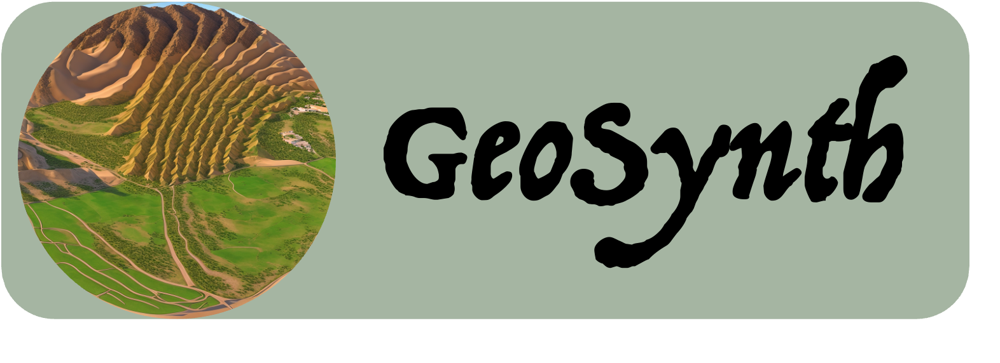
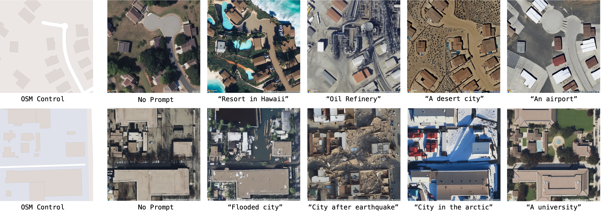
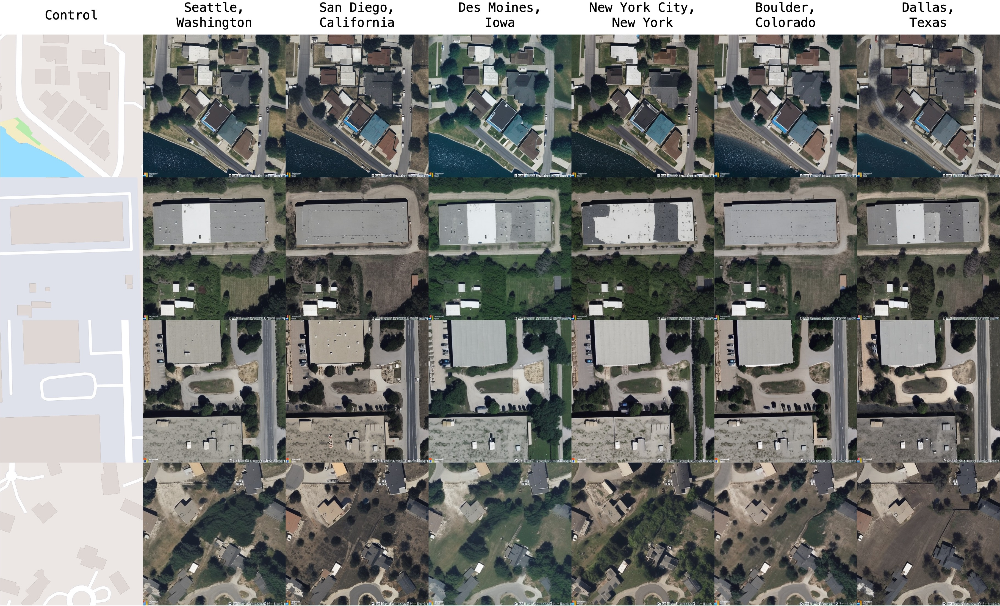

# GeoSynth: Contextually-Aware High-Resolution Satellite Image Synthesis
<div align="center">


[](https://arxiv.org/abs/2404.06637)
[]()
[](https://huggingface.co/spaces/MVRL/GeoSynth)</center>

[Srikumar Sastry*](https://sites.wustl.edu/srikumarsastry/),
[Subash Khanal](https://subash-khanal.github.io/),
[Aayush Dhakal](https://scholar.google.com/citations?user=KawjT_8AAAAJ&hl=en),
[Nathan Jacobs](https://jacobsn.github.io/)
(*Corresponding Author)
</div>

This repository is the official implementation of [GeoSynth](https://arxiv.org/abs/2404.06637) [CVPRW, EarthVision, 2024].
GeoSynth is a suite of models for synthesizing satellite images with global style and image-driven layout control.



Models available in 🤗 HuggingFace diffusers:

GeoSynth: [](https://huggingface.co/MVRL/GeoSynth)

GeoSynth-OSM: [](https://huggingface.co/MVRL/GeoSynth-OSM)

GeoSynth-SAM: [](https://huggingface.co/MVRL/GeoSynth-SAM)

GeoSynth-Canny: [](https://huggingface.co/MVRL/GeoSynth-Canny)

All model `ckpt` files available here - [Model Zoo](#🐨-model-zoo) 

## ⏭️ Next
- [ ] Update Gradio demo
- [ ] Release Location-Aware GeoSynth Models to 🤗 HuggingFace
- [x] Release PyTorch `ckpt` files for all models
- [x] Release GeoSynth Models to 🤗 HuggingFace

## 🌏 Inference
Example inference using 🤗 HuggingFace pipeline:
```python
from diffusers import StableDiffusionControlNetPipeline, ControlNetModel
import torch
from PIL import Image

img = Image.open("osm_tile_18_42048_101323.jpeg")

controlnet = ControlNetModel.from_pretrained("MVRL/GeoSynth-OSM")

pipe = StableDiffusionControlNetPipeline.from_pretrained("stabilityai/stable-diffusion-2-1-base", controlnet=controlnet)
pipe = pipe.to("cuda:0")

# generate image
generator = torch.manual_seed(10345340)
image = pipe(
    "Satellite image features a city neighborhood",
    generator=generator,
    image=img,
).images[0]

image.save("generated_city.jpg")
```

## 📍 Geo-Awareness

Our model is able to synthesize based on high-level geography of a region:

<div align="center">
</img>
</div>

## 🧑‍💻 Setup and Training

Look at [train.md]() for details on setting up the environment and training models on your own data.

## 🐨 Model Zoo
Download GeoSynth models from the given links below:

|Control|Location|Download Url|
|----------|--------|----------|
|-|❌|[Link](https://huggingface.co/MVRL/GeoSynth/blob/main/sd-base-geosynth.ckpt)|
|OSM|❌|[Link](https://huggingface.co/MVRL/GeoSynth-OSM/blob/main/geosynth-osm-text.ckpt)|
|SAM|❌| [Link](https://huggingface.co/MVRL/GeoSynth-SAM/blob/main/geosynth_sam.ckpt)|
|Canny|❌| [Link](https://huggingface.co/MVRL/GeoSynth-Canny/blob/main/geosynth_canny_text-v1.ckpt)|
|-|✅|[Link](https://huggingface.co/MVRL/GeoSynth-Location/blob/main/geosynth_sd_loc-v3.ckpt)|
|OSM|✅|[Link](https://huggingface.co/MVRL/GeoSynth-Location/blob/main/geosynth_osm_text_loc-v2.ckpt)|
|SAM|✅| [Link]()|
|Canny|✅| [Link](https://huggingface.co/MVRL/GeoSynth-Location-Canny/blob/main/geosynth_loc_canny.ckpt)|


## 📑 Citation

```bibtex
@inproceedings{sastry2024geosynth,
  title={GeoSynth: Contextually-Aware High-Resolution Satellite Image Synthesis},
  author={Sastry, Srikumar and Khanal, Subash and Dhakal, Aayush and Jacobs, Nathan},
  booktitle={Proceedings of the IEEE/CVF Conference on Computer Vision and Pattern Recognition Workshops (CVPRW)},
  year={2024}
}
```

## 🔍 Additional Links
Check out our lab website for other interesting works on geospatial understanding and mapping;
* Multi-Modal Vision Research Lab (MVRL) - [Link](https://mvrl.cse.wustl.edu/)
* Related Works from MVRL - [Link](https://mvrl.cse.wustl.edu/publications/)